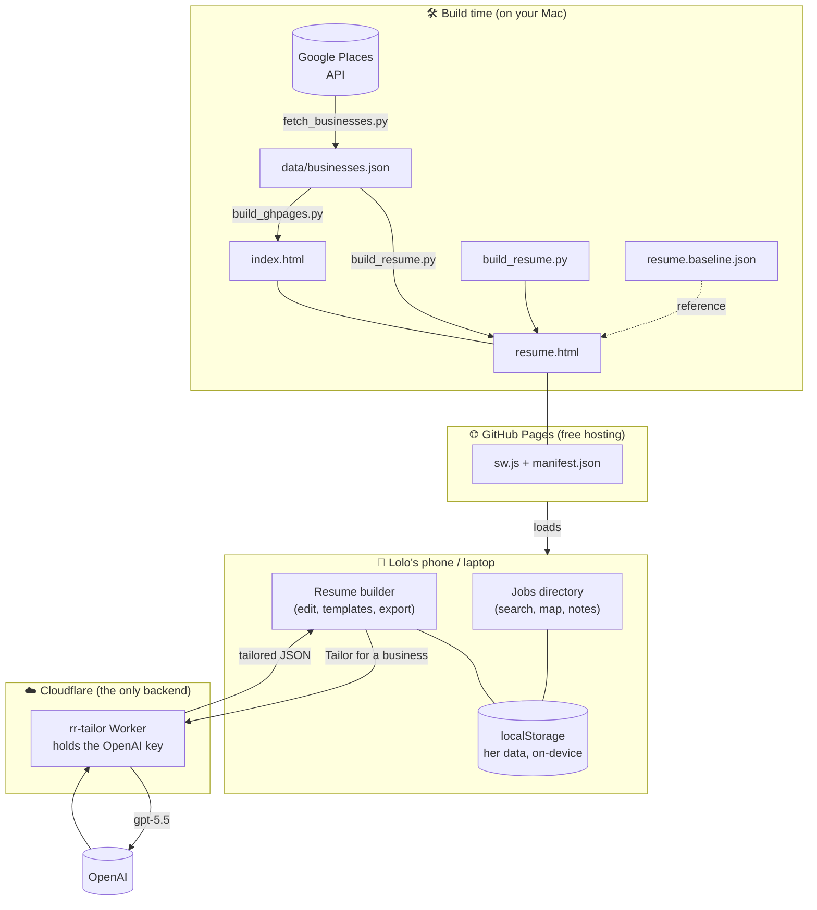
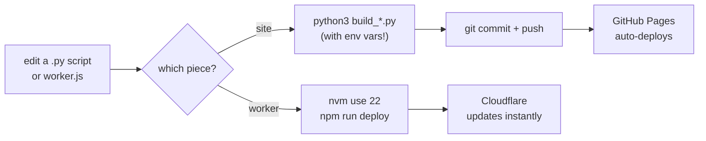

# Lolo Job Hunt — How the whole thing works

Plain-language guide to what this site is, how the pieces fit, why it was built
this way, and — most importantly — **where to change things and how to ship
them**. If you only read one section, read [The golden rule](#the-golden-rule-edit-the-scripts-not-the-html)
and [Deploy / build workflow](#deploy--build-workflow).

For narrower details this doc links out to [README.md](README.md) (setup + keys)
and [../rr-tailor-worker/README.md](../rr-tailor-worker/README.md) (the AI helper).

---

## What this is, in one breath

A personal job-hunting tool for one person (Lolo). It has two pages:

1. **A directory of local businesses** in Bundoora that hire casual staff.
2. **A resume builder** that can re-tailor her resume to any of those businesses
   and write a matching cover letter.

There is **no login and no database**. It's a plain website hosted free on
GitHub Pages, and everything Lolo types lives in her own browser. The only moving
server-side part is a tiny helper that does the AI tailoring (because that needs
a secret key that can't live in a public web page).

---

## The big picture



**The one-sentence version:** Python scripts bake the data into static HTML → the
HTML is served free by GitHub Pages → the browser does everything locally → and
*only* the "Tailor for a business" button reaches out to a small Cloudflare
Worker that safely holds the AI key.

---

## The three pieces

### 1. The jobs directory (`index.html`)

**What:** A searchable, filterable list + map of ~1,500 Bundoora-area businesses
that tend to hire casual staff, with call / directions / notes per business.

**How:** `fetch_businesses.py` queries the Google Places API and saves
`data/businesses.json`. `build_ghpages.py` then **inlines that whole dataset
directly into `index.html`** and adds the UI, a Google Maps view, and the
"viewed / notes" tracking. Those notes are saved in the browser's `localStorage`.

**Why this way:**
- *Data inlined into the page* → the list works **offline** (no API call needed
  to browse), and there's no separate database to run or pay for.
- *localStorage for notes* → no accounts, no server, her data stays on her device.
- The map is the one part that needs a live connection (Google Maps).

### 2. The resume builder (`resume.html`)

**What:** A two-pane editor — form on the left, live A4 preview on the right —
with 4 templates, fonts, colours, an optional photo, and PDF / Word / JSON export.

**How:** `build_resume.py` generates `resume.html` as a **single self-contained
file**. In the browser:
- Her resume is saved in `localStorage` under `lolo_resume_v1`.
- `resume.baseline.json` is her starting resume; a fresh device is seeded from it,
  and if it ever changes the page *offers* (never forces) the update.
- **PDF** export uses the browser's own print ("Save as PDF") so the text stays
  real and selectable — which is what job-application robots (ATS) read.
- **Word (.docx)** is assembled by hand in the page as a ZIP of XML — no
  libraries — so it works offline too.

**Why this way:**
- *One generated HTML file, no framework* → nothing to install, loads instantly,
  works from the phone home screen, survives with no signal.
- *Print-to-PDF, not a screenshot* → an image-PDF looks fine but reads as blank to
  ATS; real text gets parsed.
- *Schema borrowed from [Reactive Resume](https://github.com/amruthpillai/reactive-resume)*
  (an open-source resume app) → the "Back up" JSON is compatible with their full
  app, so she could move up to it later without retyping.

### 3. The tailoring Worker (`../rr-tailor-worker/`)

**What:** A ~230-line [Cloudflare Worker](https://developers.cloudflare.com/workers/)
— the *only* backend — that rewrites the resume for a chosen business.

**How:** When Lolo picks a business, the page sends her resume + the business
details to the Worker. The Worker calls **OpenAI (gpt-5.5, high reasoning)** and
returns a tailored headline, summary, a reordering of her existing
experience/skills/bullets, and a cover letter. The page applies this as a
**separate layer** — her saved resume is never changed, and "Clear" removes it.

**Why this way:**
- *A backend at all* → an AI call needs a secret API key, and a public web page
  can't hold a secret. The Worker holds it instead.
- *Tiny + stateless* → it stores nothing, so there's still no database and nothing
  to maintain. Free tier covers it.
- *Truthfulness is enforced* → the Worker only lets the AI **reorder real content**
  and rewrite the two summary lines; it throws away anything (an employer, a skill)
  that isn't already in her resume. It literally cannot invent facts.
- Lives **outside** the website repo because it deploys to Cloudflare, not to
  GitHub Pages.

---

## Key design decisions & why

| Decision | Why |
| --- | --- |
| Static site on GitHub Pages | Free, nothing to run, works offline. It's a tool for one person. |
| No accounts / no database | Zero login friction; her data stays on her own device. |
| Data + code baked into HTML by Python | Self-contained, offline-capable, no build framework or npm. |
| PDF via browser print | Keeps real text so applicant-tracking systems can read it. |
| Word file built by hand (no library) | No dependencies → still works offline from the home screen. |
| Tailoring in a separate layer | Her base resume is never overwritten; tailoring is reversible. |
| AI only *reorders* + rewrites 2 fields | She's applying for real jobs — the tool must never fabricate. |
| One small Worker as the only backend | The single thing that needs a secret key; keeps the site static. |

---

## The golden rule: edit the scripts, not the HTML

> **`index.html` and `resume.html` are generated files. Do NOT edit them by hand
> — your changes get wiped the next time the build runs.**

Edit the **Python builders** instead, then re-run them. Think of `.py` → `.html`
like source → compiled output.

---

## Where to edit what

| I want to change… | Edit this | Then |
| --- | --- | --- |
| The resume builder (layout, fields, export, templates) | `build_resume.py` | rebuild resume.html |
| Fonts / colours / templates offered | the `FONTS`, `COLOURS`, `TEMPLATES` lists near the top of `build_resume.py` | rebuild resume.html |
| Lolo's starting resume | `resume.baseline.json` | commit + push (page fetches it live) |
| The jobs directory (cards, filters, map) | `build_ghpages.py` | rebuild index.html |
| The list of businesses | re-run `fetch_businesses.py` (needs a Google key) | then rebuild index.html |
| The AI tailoring prompt / model / rules | `../rr-tailor-worker/worker.js` | redeploy the Worker |
| The accent colour | **both** `build_ghpages.py` and `build_resume.py` (`ACCENT_HEX`) | rebuild both, + `generate_icons.py` |
| Offline caching behaviour | `sw.js` (bump the `CACHE` version) | commit + push |

> **Accent colour is duplicated on purpose** in the two build scripts — the two
> pages ship independently. Change it in both.

---

## Deploy / build workflow

Everything below runs from `bundoora-directory/` unless noted. The site is the
git repo (`Satpat/lolo-job-hunt`); pushing to `main` auto-deploys to GitHub Pages.

### A. Change the resume builder

```bash
cd /Users/satyaveer/projects/lolo/bundoora-directory
TAILOR_WORKER_URL=https://rr-tailor.veerlo.workers.dev python3 build_resume.py
```

> ⚠️ **Always pass `TAILOR_WORKER_URL`** when rebuilding `resume.html`. Without
> it, the URL bakes in empty and **tailoring silently turns off** (the picker
> says "isn't set up yet"). The live value is `https://rr-tailor.veerlo.workers.dev`.

Then ship it:

```bash
git add resume.html build_resume.py && git commit -m "update resume builder" && git push
```

GitHub Pages redeploys within a minute or two.

### B. Change the jobs directory

```bash
cd /Users/satyaveer/projects/lolo/bundoora-directory
export GMAPS_JS_KEY=your_maps_js_key   # needed so the map works; it's public by design
python3 build_ghpages.py
git add index.html manifest.json build_ghpages.py && git commit -m "update jobs page" && git push
```

> ⚠️ The map key is *meant* to be public (Google secures it by website + API
> restriction, not secrecy). If you rebuild without `GMAPS_JS_KEY`, the map
> breaks. The current key is already in the committed `index.html` if you need to
> copy it.

### C. Refresh the business data

```bash
cd /Users/satyaveer/projects/lolo/bundoora-directory
source .venv/bin/activate
export GOOGLE_PLACES_API_KEY=your_places_key
python3 fetch_businesses.py          # rewrites data/businesses.json
python3 export_excel.py              # optional: refreshes the spreadsheet
# then rebuild BOTH pages (they both inline this data):
export GMAPS_JS_KEY=your_maps_js_key
python3 build_ghpages.py
TAILOR_WORKER_URL=https://rr-tailor.veerlo.workers.dev python3 build_resume.py
git add -A && git commit -m "refresh business data" && git push
```

### D. Change the AI tailoring (the Worker)

The Worker deploys to **Cloudflare, not GitHub** — a separate step. It needs
Node 22 (via nvm), which sits alongside your default Node 20.

```bash
cd /Users/satyaveer/projects/lolo/rr-tailor-worker
nvm use 22
npm run deploy
```

The URL (`https://rr-tailor.veerlo.workers.dev`) doesn't change, so **no site
rebuild is needed** for a Worker-only change. To change the OpenAI key:
`npm run secret`. See [../rr-tailor-worker/README.md](../rr-tailor-worker/README.md).

### The mental model



---

## Other folders in the project (context)

These sit next to `bundoora-directory/` but aren't part of the live site:

- **`rr-tailor-worker/`** — the AI Worker (live, deploys to Cloudflare). Keep it;
  it's the only copy.
- **`reactive-resume/`** — a clone of the open-source resume app, kept only as a
  **reference** (the resume schema and the tailoring idea came from it).
- **`rr-selfhost/`** — a **shelved** experiment to self-host the full Reactive
  Resume app with Docker. We chose the lightweight tailoring approach instead, so
  this isn't used. Safe to ignore or delete.

---

## Quick facts

- **Live site:** https://satpat.github.io/lolo-job-hunt/ (password-gated in the
  page; a light deterrent, not real security)
- **Repo:** `Satpat/lolo-job-hunt`, deploys from branch `main`, path `/`
- **AI Worker:** `https://rr-tailor.veerlo.workers.dev` (Cloudflare)
- **Cost:** hosting is free; each resume tailor is a few cents of OpenAI usage
- **A tailor takes** ~15–30 seconds (gpt-5.5 high reasoning is deliberately thorough)
